# Architecture Decision Document

_This document captures collaborative architecture decisions for CBLAero and is the implementation source of truth for AI agents._

## Project Context Analysis

### Requirements Overview

- 75 FRs across 3 tiers: candidate management, outreach/engagement, recruiter workflow, scoring/matching, delivery analytics, compliance/governance.
- NFRs: 99.5% uptime, 24-hour delivery SLA for 5 candidates, <1-minute notification latency, GDPR/CCPA/TCPA, SOC 2 trajectory, tamper-evident audit.
- Architecture classification: event-rich workflow system with strict multi-tenant data boundaries, 12–16 bounded components, compliance as a first-order design concern.

### Technical Constraints and Dependencies

- Tiered implementation model:
  - Tier 1: manual-heavy validation path, high feedback density
  - Tier 2: automation and throughput expansion
  - Tier 3: pilot-readiness hardening
- Integration dependency on Microsoft Teams for recruiter delivery flow, with explicit outage fallback.
- Candidate trust flow requires job-scoped opt-in, one-time token links, and anti-abuse controls.
- Confidence/motivation models must remain explainable in MVP.

### Cross-Cutting Concerns Identified

- Tenant isolation and authorization enforcement at object level
- Auditability and event traceability for all critical actions
- Compliance-safe communication consent and retention
- Queueing/idempotency for outreach and notification flows
- Explainability of scoring and rejection rationale to preserve recruiter trust
- Cost guardrails and per-tenant metering readiness

## Technology Stack

### Selected Starter: Next.js App Router Baseline

```bash
npx create-next-app@latest cblaero --typescript --eslint --tailwind --src-dir --app --import-alias "@/*"
```

Runtimes: Node.js v24 LTS · Next.js 16.x · PostgreSQL 18. TypeScript-first, App Router, ESLint, `src/` layout. Fastest path to Tier 1 validation while preserving future extraction of worker services.

**First story:** initialize baseline then add auth/tenant middleware, module boundaries, and audit envelope before any feature implementation.

## Core Architectural Decisions

### Data Architecture

- Primary OLTP database: Supabase Postgres (PostgreSQL 18-compatible target).
- **Record scale:** 1M existing candidate records at launch; projected 3M+ by Year 1 via ongoing recruiter uploads and automated ATS/email sync. All queries, indexes, and pagination strategies must be designed for 1M+ rows from day one — no deferred scaling assumptions.
- Data strategy:
  - Relational core for transactional consistency
  - Event outbox for reliable asynchronous publication
  - Materialized read models for dashboards and SLA views
  - Cursor-based pagination enforced on all candidate list endpoints (no offset pagination at scale)
  - Composite partial indexes on `(tenant_id, availability_status)`, `(tenant_id, location)`, `(tenant_id, cert_type)` to keep filtered queries sub-second at 1M+ rows
- Canonical entities:
  - `tenant`, `user`, `role_assignment`
  - `candidate`, `candidate_identity_link`, `candidate_availability_signal`
  - `job_requirement`, `job_intake_question`, `candidate_match`
  - `outreach_message`, `consent_record`, `delivery_attempt`
  - `interaction_event`, `audit_event`, `teams_notification`
  - `import_batch`, `import_row_error` (tracks all bulk upload and sync jobs with per-row error audit)
- Dedupe strategy:
  - Deterministic identity confidence thresholds per PRD
  - Manual review queue for uncertain merges
  - Dedupe runs asynchronously post-import; records are created in `pending_dedup` state before promotion to active
- Retention/deletion:
  - Policy-driven lifecycle with legal hold support
  - GDPR erase workflow as first-class background process
  - Voice call recordings and transcripts retained in Supabase for 3 years

### Candidate Data Ingestion Architecture

Three ingestion paths are supported; all funnel through the same deduplication and enrichment pipeline.

**Path 1 — Initial bulk load (one-time, admin-supervised):**
- 1M existing records loaded via a Python migration script (not the live web app).
- Runs as a rate-limited batch against the Supabase service role from a Render one-off job.
- Chunks of 1,000 rows per transaction; progress written to `import_batch` table.
- Rollback capability: if error rate exceeds 5% within a chunk, the job pauses and alerts admin.
- Post-load: async deduplication worker runs over the full batch to collapse identity matches.
- Enrichment of the initial 1M runs as an overnight batch job at 100 candidates/sec; not a real-time process.

**Path 2 — Recruiter CSV uploads (daily/weekly, ongoing):**
- Web UI: drag-and-drop CSV with column mapping wizard and live validation preview.
- Max 10,000 records per recruiter upload; larger batches must be split or handled via admin migration path.
- Validated rows are written to `import_batch` table; a background worker processes the batch.
- Per-row error report available for download after processing (missing required fields, failed dedup rules, invalid format).
- Imported records enter `pending_enrichment` state; enrichment worker picks them up via outbox.

**Path 3 — ATS connector and email inbox sync (automated, Tier 2):**
- ATS connector: read-only polling of configured ATS API at scheduled intervals (minimum 15-minute interval per connector). New and updated records are upserted via standard deduplication pipeline with `source: ats_sync` attribution.
- Email inbox parsing: Microsoft Graph polls designated recruiter inboxes; forwarded resumes and candidate reply threads are parsed to extract candidate stubs. Parsed stubs are queued for recruiter review before activation (not auto-activated).
- Both paths write to `import_batch` with source attribution; sync errors alert the admin and never silently discard records.
- Admin console shows per-connector: last sync timestamp, records synced/skipped/errored, and error rate trend.

### Authentication and Security

- Authentication:
  - Candidate: one-time token links, short-lived verification step
  - Internal users: SSO-ready session model and step-up auth for sensitive operations
- Authorization:
  - RBAC + tenant-scoped object checks on every read/write path
- Security controls:
  - Signed token links, replay protection, and strict expiry
  - Rate limiting and abuse detection on public-facing endpoints
  - PII encryption at rest and in transit
  - Security-relevant action logging into immutable audit stream

### API and Communication Patterns

- External API style: REST with explicit resource scoping and contract versioning.
- Internal async pattern: transactional outbox plus background workers.
- **Outbox implementation contract:**
  - A Postgres trigger (or application service) writes an `outbox` row **in the same transaction** as the state mutation. The DB is the single source of truth for event generation — no event can be lost due to an app crash between persist and enqueue.
  - A dedicated relay worker polls the `outbox` table and publishes events to background workers with full retry, dead-letter, and idempotency control.
  - **Supabase Database Webhooks (`pg_net` HTTP callbacks) are explicitly not used as the delivery mechanism.** They are fire-and-forget with no backpressure, no dead-letter queue, and no delivery ordering guarantees — insufficient for TCPA-compliant outreach and immutable audit requirements. They may be used for low-stakes internal notifications only (e.g., alerting the ops channel on a schema migration), never for the critical event pipeline.
- Response contract:
  - success: `{"data": ..., "meta": ...}`
  - error: `{"error": {"code": "...", "message": "...", "details": ...}}`
- Idempotency requirements:
  - Outreach scheduling and notification sends require idempotency keys.
- Retry behavior:
  - Bounded retries with escalating delay and dead-letter classification.

### Agentic Control Plane and Worker Model

This implementation uses a goal-driven multi-agent execution model, not just background jobs.

**Control-plane agents:**

- Orchestrator Agent:
  - Receives incoming objectives (for example, deliver 5 qualified candidates in 24 hours).
  - Selects the execution plan and worker sequence.
  - Resolves conflicts between worker outputs and chooses final action set.
  - Aggregates partial results into one decision package for recruiter-facing delivery.
- Goal Manager Agent:
  - Tracks active goals, sub-goals, deadlines, and completion criteria.
  - Monitors whether current worker execution is moving toward KPI targets.
  - Replans worker assignments when progress stalls or constraints change.
  - Enforces stop/retry/escalate policy for failed goal paths.

**Execution workers (specialized agents):**

- Sourcing Worker: candidate discovery and enrichment through internal DB, Clay, and RapidAPI connectors.
- Matching Worker: scoring, rank generation, and explanation payloads.
- Outreach Worker: SMS/email campaign and ad hoc communication tasks.
- Scheduling Worker: Teams scheduling/task creation and recruiter action orchestration.
- Compliance Worker: consent checks, audit events, FAA/manual verification routing.
- Cost Guardrail Worker: threshold checks (`API`, `SMS`, KPI alerts) and budget-triggered recommendations.

**Learning and adaptation loop:**

- Reporting Agent:
  - Produces progress reports for each active goal (status, risk, blockers, confidence).
  - Feeds structured feedback signals back to Orchestrator and Goal Manager.
- Worker Coaching and Policy Tuning Agent:
  - Uses historical execution outcomes to tune routing rules, prompt templates, and thresholds.
  - Updates worker playbooks and run-time policies after approval gates.
  - Does not perform unsupervised model fine-tuning in MVP; learning is policy-level and auditable.

**Decision governance rules:**

- All agent decisions must be traceable via correlation ID and tenant ID.
- Orchestrator decisions are auditable and stored in append-only event history.
- High-impact actions (bulk changes, exports, compliance overrides) require human-in-the-loop confirmation.
- If worker outputs disagree, Orchestrator uses deterministic arbitration policy and logs rationale.
- Every goal has a hard `max_iterations` and `max_consecutive_failures` budget; breach triggers human-in-the-loop pause — see _Architecture Resilience Decisions §1_.
- Cold-start tenants (< 10 placements) operate in bootstrap mode with global anonymized baselines — see _Architecture Resilience Decisions §2_.

### Agentic Architecture Diagram (Control Plane)

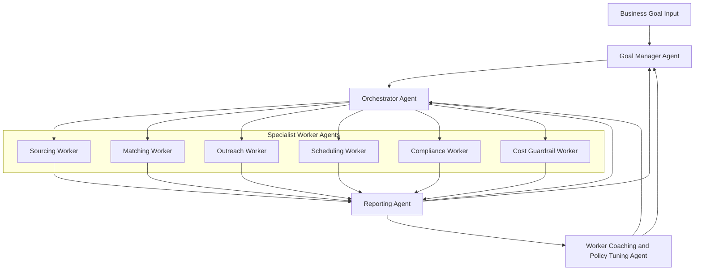

### Agentic Execution Sequence (Goal to Aggregated Result)

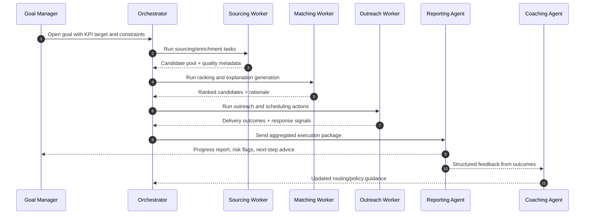

### Frontend Architecture

- Next.js App Router UI with feature-bounded folders.
- Core application surfaces:
  - Recruiter workspace (action stream, candidate cards, match reasons)
  - Candidate portal (job-scoped trust-first opt-in flow)
  - Delivery lead operations console
  - Admin and compliance console
- State strategy:
  - Server-driven data for most views
  - Client state only for transient workflow/UI state
- UX-critical architecture requirements:
  - Explicit rejection reasons and override traceability
  - Progressive disclosure for high-volume candidate sets
  - Accessibility baseline with WCAG 2.1 AA alignment

### Infrastructure and Deployment

- Baseline deployment:
  - Web/API runtime deployed on Render
  - Python worker services deployed on Render background workers
  - Data platform on Supabase Postgres (managed Postgres on Render is not used)
  - Separate staging and production environments
- CI/CD expectations:
  - Test gates including tenant isolation test suite
  - Migration checks and backward compatibility checks for schema changes
  - Security/static analysis checks on protected branches
- Observability:
  - Render-native metrics/logging and Supabase-native telemetry
  - Structured logs with correlation IDs
  - Metrics for SLA, delivery latency, queue depth, and failure rates
  - Alerts for fallback triggers, compliance workflow failures, and budget thresholds
- Secrets and configuration:
  - Render environment secrets only for MVP

### Confirmed Integration System Matrix

| Capability | Selected System | MVP Notes |
|---|---|---|
| SMS (two-way) | Telnyx | Primary provider; no backup SMS provider in MVP |
| Voice calling | Telnyx Voice | Dial + call recording + transcription |
| Email campaigns | Instantly | Campaign orchestration and delivery analytics |
| Ad hoc recruiter email | Microsoft Graph/Outlook | One-click recruiter email actions |
| Teams collaboration | Microsoft Teams | Notification cards, task creation, scheduling, recruiter communication |
| Identity | Microsoft Entra ID + magic links | Internal SSO for staff, SMS/email magic links for candidates |
| Candidate enrichment | Internal DB, Clay, RapidAPI sources | Provider-agnostic connector layer remains mandatory |
| FAA verification | Official FAA public data + manual workflow | Automated third-party FAA API deferred |
| Background checks | Manual only | No background-check API integration in MVP |
| Job queue and retries | Render background workers | Async processing and retry handling on worker services |
| Monitoring and alerting | Render + Supabase native | No external APM in MVP |
| Secrets management | Render environment secrets | External vault deferred |
| Audit immutability | DB append-only + hash chain | Tamper-evidence implemented in audit model |
| Document/file storage | SharePoint folder | `https://cblsolution-my.sharepoint.com/:f:/g/personal/vivek_cblsolutions_com/IgDKIFYS0joSSbhgfpiY6XA_AbVtySkMKVQAIZwkiyZblTg?e=QTy2dU` |
| Analytics/BI | In-app only | External BI warehouse/tools deferred |

### C4 Container Diagram (MVP)

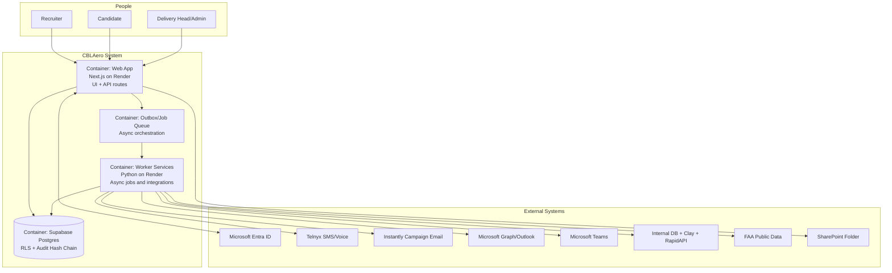

### Sequence Diagram (Candidate Outreach to Recruiter Notification)

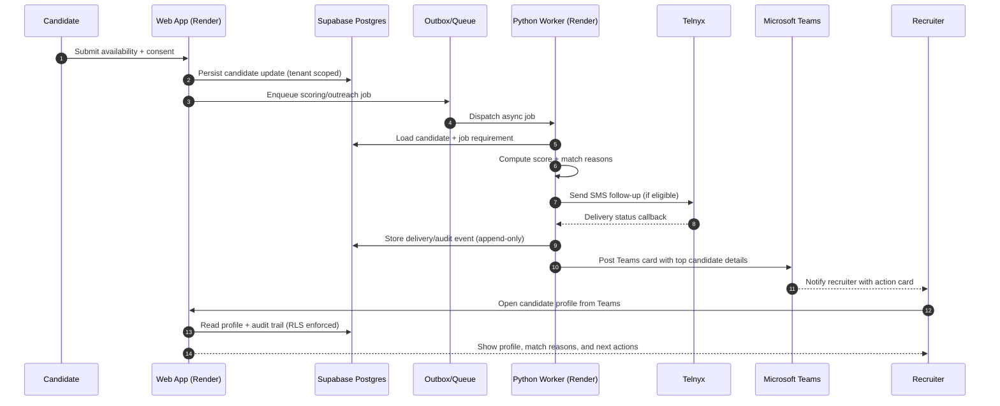

### Sequence: Candidate Magic-Link Authentication

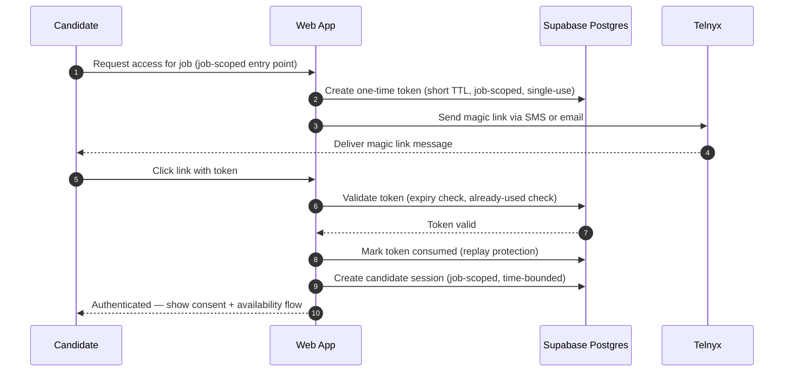

### Sequence: Internal Recruiter SSO Login (Entra ID)

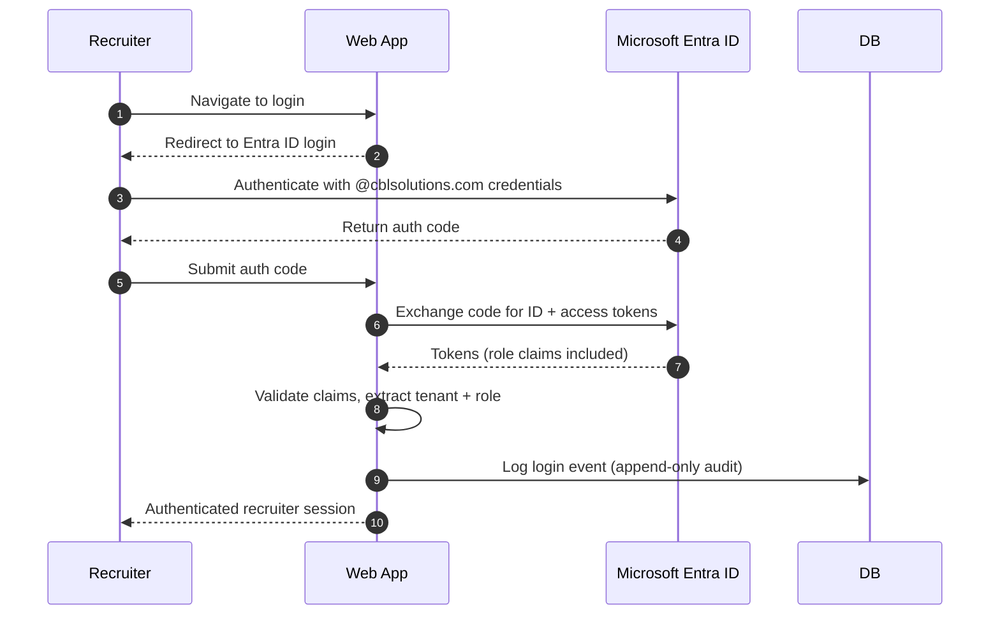

### Sequence: Job Intake to Ranked Candidate Delivery

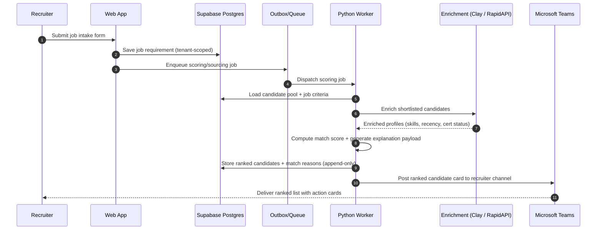

### Sequence: Recruiter Teams Action to Candidate Outreach

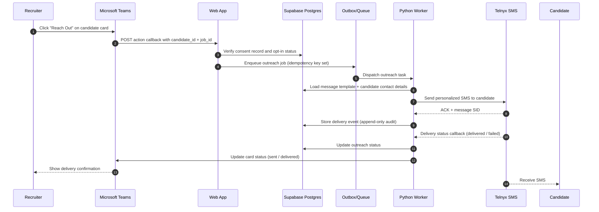

### Sequence: Two-Way SMS Conversation

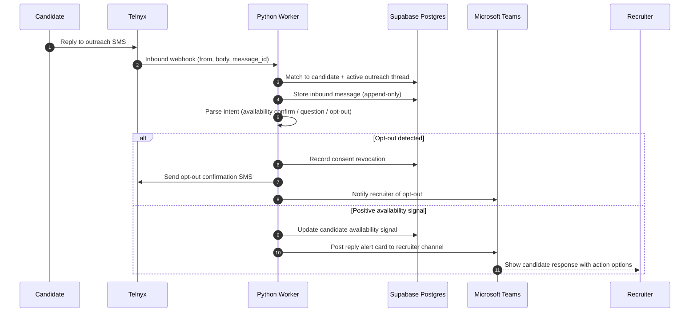

### Sequence: Instantly Campaign Email Flow

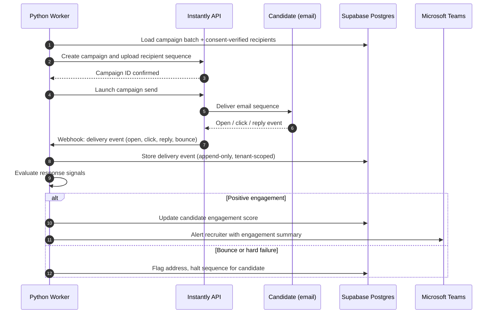

### Sequence: Enrichment Pipeline Execution

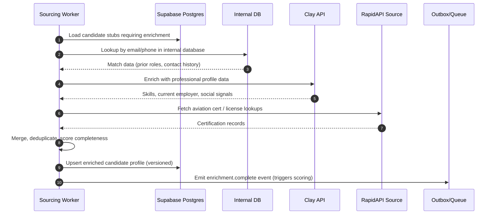

### Sequence: Bulk CSV Candidate Import (Recruiter Upload)

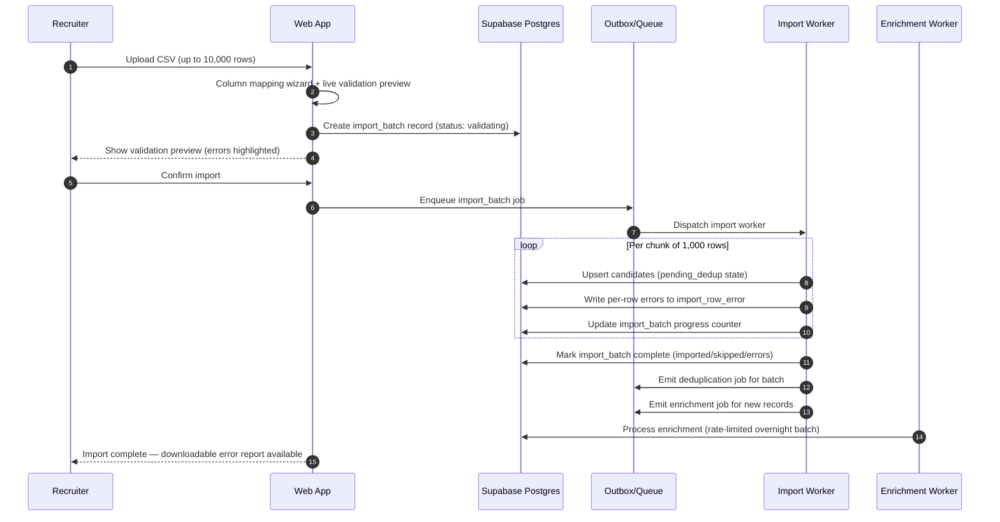

### Sequence: ATS Connector Sync (Automated, Tier 2)

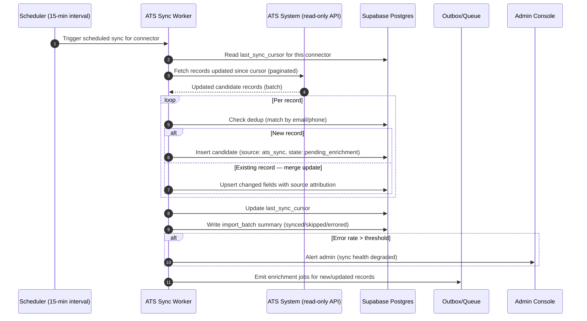

### Sequence: Email Inbox Parsing to Candidate Stub (Tier 2)

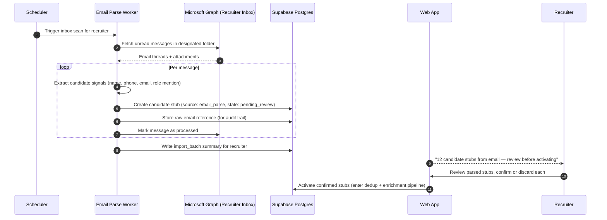

### Sequence: Manual FAA Verification Workflow

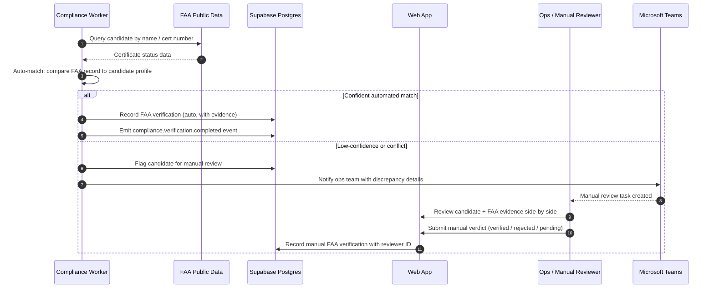

### Sequence: GDPR / CCPA Data Erasure Request

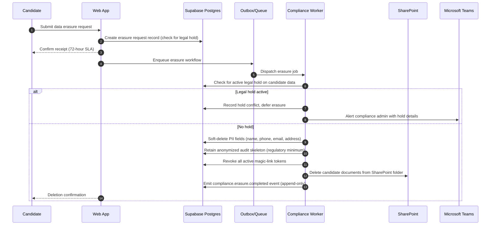

### Sequence: Step-Up Auth for High-Risk Action

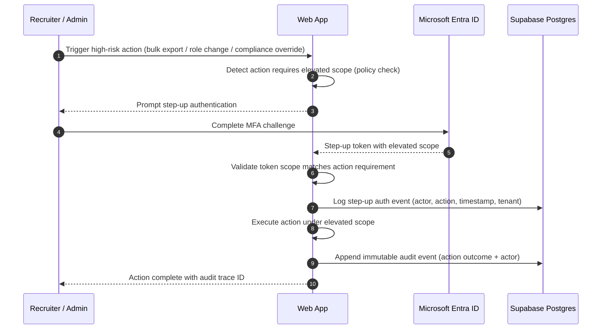

### Sequence: Cost Guardrail Trigger and Replan

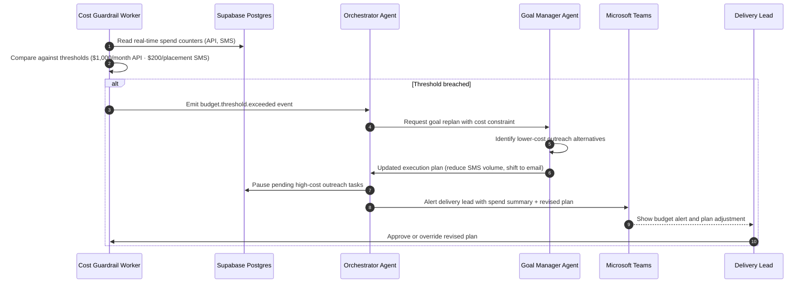

### Budget and KPI Alert Baselines

- API spend alert threshold: $1,000/month
- SMS cost alert threshold: $200/placement
- KPI breach alert threshold: conversion rate <5%

### Architecture Standards and Governance

**Standards we follow for implementation:**

- C4 model for architecture views and boundary documentation (Context, Container, Component).
- Domain-oriented module boundaries (bounded-context style) aligned to FR domains.
- Twelve-Factor app principles for config, stateless runtime, and environment parity.
- OWASP ASVS L2 and OWASP API Security Top 10 as baseline application/API security standard.
- Zero-trust access posture for internal services and operational tools.

**Vector and RAG standard (when introduced):**

- RAG is not mandatory for Tier 1 MVP. If introduced, it must be tenant-safe by design.
- Vector storage standard: `pgvector` in Supabase Postgres under isolated schema.
- Retrieval must enforce tenant filter + role filter before semantic ranking.
- Prompt input pipeline must include prompt-injection detection and policy filtering.
- PII and sensitive compliance data are excluded from embeddings unless explicitly approved.

**MCP-based access control standard:**

- MCP usage must be brokered through a server-side policy gateway.
- Tool access is allowlisted per role and per environment.
- Every MCP tool invocation must include actor, tenant, scope, and trace ID.
- High-risk MCP operations (export, bulk update, credentialed actions) require step-up auth and audit trail.

**Strict Supabase access from Python standard:**

- Python workers access Supabase only from trusted backend runtime on Render.
- Service-role key is never exposed to browser/client code.
- Candidate-facing and recruiter-facing app paths use RLS-protected tokens; service role bypass is backend-only.
- Separate key scopes by environment (`dev`, `staging`, `prod`) with rotation policy.
- Use least-privilege SQL roles for worker jobs where possible; avoid broad superuser privileges.
- All Python DB calls must use TLS and connection settings enforcing certificate verification.
- Administrative SQL operations are restricted to migration pipeline and audited maintenance workflows.

**SSL/TLS implementation standard:**

- External traffic: HTTPS only with TLS 1.2+ (TLS 1.3 preferred) at edge.
- Enforce HTTP->HTTPS redirects and HSTS for authenticated application surfaces.
- Service-to-database traffic: TLS required (`sslmode=require` minimum, `verify-full` where supported).
- Certificates are managed by platform-managed TLS endpoints (Render and Supabase) with automatic renewal.
- No plaintext credentials or connection strings in source control; all secrets via Render environment secrets.

**Related ADRs:**

- `docs/planning_artifacts/adr/README.md`
- `docs/planning_artifacts/adr/0001-security-baseline-and-zero-trust.md`
- `docs/planning_artifacts/adr/0002-rag-and-vector-governance.md`
- `docs/planning_artifacts/adr/0003-mcp-tool-access-control.md`
- `docs/planning_artifacts/adr/0004-supabase-access-for-python-workers.md`
- `docs/planning_artifacts/adr/0005-transport-and-tls-standards.md`

## Architecture Resilience Decisions

Closed decisions for 8 operational risk areas identified during architecture review.

### 1. Agentic Loop Prevention and Human-in-the-Loop Circuit Breaker

**Decision:** Every active goal has a hard execution budget attached at creation time.

- `max_iterations`: the Orchestrator may attempt at most N replanning cycles per goal (default 5).
- `max_consecutive_failures`: if any single worker fails ≥ 3 consecutive tasks within one goal run, the Orchestrator pauses the goal and creates a human-review task (Teams card + DB `goal_review_required` flag) before spending any further API budget.
- `escalation_timeout`: if a paused goal is not reviewed within 30 minutes, the Goal Manager auto-escalates to the delivery head's Teams channel.
- All circuit-breaker state transitions (pause, escalate, resume, abandon) are stored as append-only events with `correlation_id`, `tenant_id`, and `cost_at_trigger`.
- The Coaching Agent must not apply policy changes until the human reviewer approves the resumed goal — no unsupervised replan loops.

**Runaway cost guard:** The Cost Guardrail Worker (see item 8) enforces a hard stop on API spend regardless of goal state. Circuit breaker and cost stop are independent — either can halt execution independently.

### 2. Cold-Start Behavior for New Tenants

**Decision:** The Sourcing and Matching workers operate in explicit bootstrap mode when `tenant.placement_count < 10`.

- Scoring weights fall back to global anonymized aggregate baselines (computed from all tenants, fully anonymized, stored in a read-only `global_signal_defaults` table — never from another tenant's raw data).
- Enrichment weighting is increased in bootstrap mode (heavier reliance on external enrichment vs. internal historical signal) since there is no interaction history to calibrate against.
- The Coaching Agent does not apply tenant-specific policy tuning until the tenant exits bootstrap mode. Bootstrap threshold (10 placements) is configurable per tenant by admin.
- The UI shows a "New account — improving with each placement" indicator on scoring explanations while in bootstrap mode so recruiters understand why explanation detail is lower.

### 3. Enrichment Pipeline Tenant PII Isolation

**Decision:** Supabase RLS is the DB boundary; the enrichment connector layer is the API boundary. Both must enforce tenant isolation independently.

- Every enrichment request from Clay or RapidAPI is tagged with `tenant_id` at the point of outbound call construction.
- Enrichment results are stored immediately under `candidate_enrichment` rows with `tenant_id` as a non-nullable partition key. No enrichment result is ever written without a tenant ID.
- **No shared enrichment cache.** There is no cross-tenant cache layer in MVP. Each tenant's enrichment queries are independent calls. Caching (if introduced) must be scoped to `(tenant_id, candidate_id, source_id)` with explicit eviction on erasure requests.
- The Python connector module enforces: if the `tenant_id` derived from the job context does not match the `tenant_id` on the candidate being enriched, the call is rejected and a `security.tenant_mismatch` audit event is emitted.

### 4. Partial Erasure Under Legal Hold

**Decision:** The Compliance Worker produces a structured erasure receipt on every erasure request regardless of hold status.

Erasure receipt fields:
- `erased_fields`: list of field names nulled/pseudonymized (e.g. `name`, `phone`, `email`, `address`)
- `retained_fields`: list of field names retained and the legal basis (e.g. `audit_event_skeleton` retained under `legal_hold_id`)
- `hold_reference`: hold ID, hold type, estimated hold expiry date (if known)
- `erasure_status`: `COMPLETE` | `PARTIAL_HOLD` | `DEFERRED`

The Web App surfaces this receipt as a two-panel compliance summary:
- Left: "Deleted" (green) — personal identifiers removed
- Right: "Retained" (amber) — retained data with the legal basis and estimated hold duration

The recruiter/admin cannot dismiss this view without acknowledging it; the acknowledgement is itself written as an audit event.

### 5. Teams API Timeout Strategy

**Decision:** Microsoft Teams notifications are a secondary async event that must never block the primary DB write.

- The worker writes the DB update (the primary state transition) first, unconditionally.
- The Teams notification call is issued with a **5-second timeout**.
- On timeout or non-2xx response: the failed notification is written to the `outbox` table as a `teams_notification.pending` event with retry metadata (attempt count, next retry time using exponential backoff, max 3 retries).
- After 3 failed retries, the record is moved to dead-letter state and a `teams_notification.dead_letter` audit event is emitted. The delivery lead is alerted via the fallback path (email via Microsoft Graph) if a notification has been dead-lettered.
- Workers never `await` a Teams call in the critical path of an outreach or scoring job.

### 6. Consent Synchronization Latency (SMS Opt-Out → Kills Pending Email)

**Decision:** Consent revocation is a synchronous, highest-priority operation — it must complete before the Telnyx webhook response is returned.

Processing order on inbound opt-out:
1. Telnyx webhook received by webhook receiver worker.
2. **Synchronously** within the request handler: write `consent_record` revocation row to DB with `revoked_at`, `channel`, and `source_message_id`. This write must commit before the 200 OK is returned to Telnyx.
3. The outbox relay's dispatch step checks `consent_record` status on every job dequeue — if revoked, the job is cancelled before any API call is made. This means even tasks already in the queue will not execute.
4. Any Instantly campaigns with this candidate in an active sequence: the relay cancel logic cancels the pending outbox row AND calls `Instantly API: remove from sequence` within the same transaction-like flow. Target latency from Telnyx webhook receipt to all pending tasks cancelled: **< 5 seconds**.
5. A `compliance.consent.revoked` audit event is emitted and a Teams notification is sent to the recruiter (async, non-blocking).

**Anti-pattern explicitly prohibited:** checking consent only at enqueue time. Consent must be checked at enqueue AND at dequeue.

### 7. Webhook Burst Handling (Instantly / Telnyx at Scale)

**Decision:** The webhook receiver is a thin, stateless ingestion layer that decouples ingest rate from processing rate.

- Webhook endpoints (`POST /webhooks/telnyx`, `POST /webhooks/instantly`) do exactly one thing: validate the request signature, write a raw event row to `webhook_events` table, return `200 OK`. No business logic in the handler. Target response time < 100ms.
- A separate outbox relay worker drains `webhook_events` rows and performs the business logic (consent checks, scoring updates, delivery tracking). This worker scales horizontally on Render background workers.
- Render background workers scale horizontally within the plan limits. For MVP, configure minimum 2 replicas for the webhook processing worker to handle concurrent bursts.
- An unprocessed `webhook_events` queue depth alert is configured: if depth > 200 for > 60 seconds, alert the delivery lead. This is the early warning before processing falls behind.
- Idempotency: the `webhook_events` table has a unique constraint on `(source, message_id)` — duplicate webhook deliveries are deduplicated at insert.

### 8. Cost Guardrail Granularity

**Decision:** Costs are tracked via real-time atomic DB counters, not batch/daily sync.

- A `cost_counter` table has one row per `(tenant_id, counter_type, billing_period)` with an atomic `amount_cents` column.
- Every outreach dispatch (SMS send, email send, enrichment API call) performs an `UPDATE cost_counter SET amount_cents = amount_cents + $cost WHERE tenant_id = $tid AND counter_type = $type AND billing_period = $period RETURNING amount_cents` inside the same DB transaction as the outbox job claim.
- If `RETURNING amount_cents` exceeds the threshold for that `counter_type`, the job is aborted before the external API call is made. No API request is issued for an over-budget tenant.
- The Cost Guardrail Worker also runs a 1-minute polling loop as a macro check across all tenants (catches accumulated small increments that might slip past per-request checks during concurrent bursts).
- Thresholds: API `$1,000/month` (hard stop at `$950` + alert delivery lead), SMS `$200/placement` (hard stop at `$180` + alert recruiter).
- All budget stops are written as `cost.threshold.exceeded` audit events and surface in the operations console.

## Implementation Patterns and Consistency Rules

### Pattern Categories Defined

Critical conflict points identified: naming, API contract shape, event semantics, and cross-module boundaries.

### Naming Patterns

**Database naming conventions:**

- Tables: `snake_case`, plural (`candidates`, `job_requirements`)
- Columns: `snake_case`
- FK fields: `<entity>_id`
- Indexes: `idx_<table>_<column_list>`

**API naming conventions:**

- Endpoint paths: plural nouns (`/api/v1/candidates`)
- Route params: kebab path segments with IDs as UUID strings
- Query params: `snake_case`

**Code naming conventions:**

- TypeScript types/interfaces: `PascalCase`
- Variables/functions: `camelCase`
- File names:
  - React components: `PascalCase.tsx`
  - non-component modules: `kebab-case.ts`

### Structure Patterns

- Organize by feature domain first, technical type second.
- Every feature domain has explicit layers:
  - `contracts`
  - `application`
  - `domain`
  - `infrastructure`
  - `ui` (where applicable)
- No direct cross-feature imports except through published feature contracts.

### Format Patterns

- API response and error envelopes are mandatory and stable.
- Dates/times use ISO 8601 UTC (`YYYY-MM-DDTHH:mm:ss.sssZ`).
- IDs use UUIDv7 (or UUIDv4 if v7 support unavailable at initialization).
- Booleans are strict true/false, never numeric substitutions.

### Communication Patterns

- Event naming: `<bounded_context>.<aggregate>.<past_tense_verb>`
  - Example: `outreach.message.sent`
- Event envelope:
  - `event_id`, `event_type`, `occurred_at`, `tenant_id`, `actor_id`, `payload`, `schema_version`
- Correlation and causation IDs required for all async workflows.

### Process Patterns

**Error handling:**

- Domain errors are explicit typed errors.
- User-facing messages are safe/sanitized.
- Internal diagnostics are captured in structured logs only.

**Loading and async status:**

- Long-running operations expose explicit status resources.
- UI polling intervals are bounded and adaptive.
- Retries are never silent; retry state is observable in operations views.

### Enforcement Guidelines

All AI agents must:

- Respect module boundaries and public contracts.
- Use the standard API and event envelopes.
- Preserve tenant ID propagation in all data and event paths.
- Include tests for boundary, authorization, and idempotency behavior.

Pattern enforcement:

- Pull request checklist for architecture contract compliance
- Contract tests for API envelope and event schema stability
- Lint and static import-boundary checks

### Pattern Examples

**Good example (event):**

- `candidate.availability.updated` with `tenant_id`, `candidate_id`, `previous_state`, `new_state`, `source`

**Anti-patterns to avoid:**

- Direct cross-tenant queries without explicit tenant predicate
- Sending Teams notifications without idempotency key
- Feature module accessing another feature's private persistence layer

## Project Structure and Boundaries

### Complete Project Directory Structure

```text
cblaero/
  README.md
  package.json
  pnpm-workspace.yaml
  .env.example
  .github/
    workflows/
      ci.yml
      security.yml
  apps/
    web/
      package.json
      next.config.ts
      tsconfig.json
      src/
        app/
          (recruiter)/
            dashboard/page.tsx
            jobs/[jobId]/page.tsx
            candidates/[candidateId]/page.tsx
          (candidate)/
            portal/[token]/page.tsx
            availability/page.tsx
          (ops)/
            delivery/page.tsx
            compliance/page.tsx
          api/
            v1/
              candidates/route.ts
              jobs/route.ts
              outreach/route.ts
              notifications/route.ts
              reports/route.ts
          layout.tsx
          page.tsx
        features/
          candidate-management/
            contracts/
            application/
            domain/
            infrastructure/
            ui/
          outreach-engagement/
            contracts/
            application/
            domain/
            infrastructure/
            ui/
          recruiter-workflow/
            contracts/
            application/
            domain/
            infrastructure/
            ui/
          scoring-matching/
            contracts/
            application/
            domain/
            infrastructure/
            ui/
          compliance-governance/
            contracts/
            application/
            domain/
            infrastructure/
            ui/
          analytics-operations/
            contracts/
            application/
            domain/
            infrastructure/
            ui/
        shared/
          auth/
          tenancy/
          api/
          observability/
          validation/
          ui/
  workers/
    outreach-worker/
      src/
        jobs/
        retries/
        adapters/
    notifications-worker/
      src/
        teams/
        email/
        sms/
  packages/
    contracts/
      src/api/
      src/events/
    config/
      eslint/
      typescript/
    test-utils/
      src/
  db/
    prisma/
      schema.prisma
      migrations/
    seeds/
  docs/
    architecture/
      adr/
      api-contracts/
      event-catalog/
  tests/
    unit/
    integration/
    e2e/
    adversarial/
      tenant-isolation/
      token-abuse/
```

### Architectural Boundaries

**API boundaries:**

- Public candidate portal endpoints are isolated from authenticated internal endpoints.
- Internal API requires authenticated session and tenant context.

**Component boundaries:**

- Feature modules communicate through typed contracts only.
- UI components do not call persistence adapters directly.

**Service boundaries:**

- Worker services consume outbox events and invoke channel adapters.
- Notification channel adapters are pluggable and isolated from domain logic.

**Data boundaries:**

- Tenant-owned data partitioning enforced via tenant key and policy layer.
- Audit event store treated as append-only with hash-chain tamper-evidence.

### Requirements to Structure Mapping

**Feature/FR domain mapping:**

- Candidate management FRs (`FR1-FR7`) -> `features/candidate-management`
- Outreach and engagement FRs (`FR8-FR17`) -> `features/outreach-engagement` + `workers/outreach-worker`
- Recruiter workflow FRs (`FR18-FR27`) -> `features/recruiter-workflow`
- Scoring/matching FRs (`FR28+` scoring set) -> `features/scoring-matching`
- Compliance/governance FR/NFR sets -> `features/compliance-governance` + `tests/adversarial`
- Delivery analytics and KPI reporting -> `features/analytics-operations`

**Cross-cutting concerns:**

- Auth and tenancy enforcement -> `shared/auth`, `shared/tenancy`
- Audit and observability -> `shared/observability`, `docs/architecture/event-catalog`
- API and event contracts -> `packages/contracts`

### Integration Points

**Internal communication:**

- Sync: typed application services and repository interfaces
- Async: outbox events consumed by worker services

**External integrations:**

- Telnyx for SMS and voice calling (recording and transcription)
- Instantly for campaign email
- Microsoft Graph/Outlook for ad hoc recruiter email
- Microsoft Teams for notifications, scheduling, task creation, and recruiter communication
- Candidate enrichment connectors for internal DB, Clay, and RapidAPI sources
- FAA verification via official FAA public data and manual review workflow
- SharePoint for document/file distribution in MVP

**Data flow:**

1. Candidate/job signals enter transactional core
2. Domain events emitted to outbox
3. Workers deliver outreach/notifications with retries
4. Interaction events feed scoring and analytics projections
5. Audit stream captures all critical transitions

## Architecture Validation Results

### Stack-Mapped Implementation Readiness Checklist

Use this checklist as the pre-build and pre-release gate for the chosen stack.

#### 1. Render Platform and Environment Readiness

- [ ] Separate Render services created for web app and Python workers.
- [ ] Separate `staging` and `production` environments configured.
- [ ] Environment variables and secrets loaded through Render environment secrets only.
- [ ] CI/CD pipeline includes schema migration checks and protected-branch build rules.
- [ ] Rollback procedure documented and tested for both web and worker services.

Evidence:
- Render service configuration exports/screenshots
- Deployment pipeline config and last successful staging run

#### 2. Supabase and Data Security Readiness

- [ ] Supabase project provisioned in approved US region.
- [ ] RLS policies implemented and tested for all tenant-owned tables.
- [ ] Append-only audit tables with hash-chain integrity checks implemented.
- [ ] Python workers use backend-only service credentials; no client exposure of service role keys.
- [ ] TLS enforced for all DB connections from app and workers.
- [ ] 3-year retention policy for call recordings/transcripts configured and documented.

Evidence:
- SQL migrations for RLS and audit models
- Access test report proving cross-tenant denial
- Connection settings showing TLS requirement

#### 3. Identity and Access (Entra + Candidate Magic Links)

- [ ] Microsoft Entra SSO configured for internal users.
- [ ] Candidate magic-link login flow implemented for SMS/email link entry.
- [ ] Step-up authentication enforced for high-risk actions (exports, role changes, bulk sensitive actions).
- [ ] Emergency access runbook documented and audit logging verified.

Evidence:
- Auth flow test cases and runbook
- Audit sample showing privileged action traces

#### 4. Messaging and Collaboration Integrations

- [ ] Telnyx integration live for two-way SMS.
- [ ] Telnyx voice integration live for dial, recording, and transcription.
- [ ] Instantly integration live for campaign email sends/status.
- [ ] Microsoft Graph/Outlook integration live for ad hoc recruiter email actions.
- [ ] Microsoft Teams integration live for cards, task creation, and scheduling actions.
- [ ] Retry policy (max retries, delay strategy, terminal state) implemented and tested across integrations.

Evidence:
- Integration smoke-test report per provider
- Message delivery and callback logs
- Teams card/task end-to-end test capture

#### 5. Enrichment and Compliance Workflow Readiness

- [ ] Enrichment connector layer implemented for internal DB, Clay, and RapidAPI sources.
- [ ] Provider-agnostic connector contract verified with at least two enrichment sources.
- [ ] FAA verification workflow implemented using official FAA public data + manual review.
- [ ] Background check path documented as manual-only in MVP operations SOP.

Evidence:
- Connector contract tests
- FAA verification workflow documentation and sample execution

#### 6. Security, TLS, and MCP Control Readiness

- [ ] HTTPS-only access and HSTS enabled on authenticated application surfaces.
- [ ] TLS 1.2+ enforced edge-to-client; TLS enforced service-to-database.
- [ ] MCP tool access policies implemented with role/environment allowlists.
- [ ] MCP high-risk operations protected by step-up auth and explicit audit trails.
- [ ] Secret scanning active in CI; no plaintext credentials in repository.

Evidence:
- Security config snapshots
- MCP policy definitions and deny-path test results
- CI security scan reports

#### 7. Observability, Alerts, and Cost Guardrails

- [ ] Render and Supabase native monitoring dashboards configured.
- [ ] Alert rules configured for uptime, queue failures, provider errors, and auth anomalies.
- [ ] Cost alerts configured at: API `$1,000/month`, SMS `$200/placement`.
- [ ] KPI alert configured for conversion rate `<5%`.
- [ ] Operational runbook exists for provider outage and queue fallback mode.

Evidence:
- Alert policy export
- Test alert triggers and runbook execution notes

#### 8. Testing and Release Gate

- [ ] Unit, integration, and e2e tests pass on staging.
- [ ] Tenant-isolation adversarial suite passes with zero leakage.
- [ ] External-provider outage drill validates queue mode and recovery.
- [ ] Audit immutability and hash-chain verification checks pass.
- [ ] Accessibility baseline checks pass for critical workflows.

Gate rule:
- `PASS`: all critical items complete.
- `CONCERNS`: non-critical items pending with approved mitigation owner/date.
- `FAIL`: any critical security, tenant isolation, or audit integrity item incomplete.

#### 9. Known Accepted MVP Risks

- [ ] SMS backup provider is not configured in MVP (accepted risk, monitor via outage drill).
- [ ] Background checks remain manual in MVP (accepted operational tradeoff).
- [ ] External BI remains deferred; in-app analytics only for MVP.

### Gap Analysis Results

**Critical gaps:**

- None blocking architecture initiation.

**Important gaps to close during story decomposition:**

- Finalize measurable acceptance thresholds for remaining long-tail FR/NFR entries still marked as warning in PRD validation.
- Finalize candidate portal depth boundaries for MVP vs post-MVP.
- Lock explicit forecast/cohort analytics acceptance criteria for executive workflow.

**Nice-to-have gaps:**

- Add synthetic load test profiles tied to Tier 2 and Tier 3 gates.

### Architecture Readiness Assessment

**Overall status:** READY FOR IMPLEMENTATION

**Confidence level:** Medium-high

- Medium because PRD revalidation remains at warning for residual measurability/detail gaps.
- High because architecture now absorbs and resolves previously deferred implementation choices.

**Key strengths:**

- Clear tenant-safe, compliance-aware architecture path
- Strong async workflow foundation for outreach and notifications
- Explainability-preserving scoring and decision traceability support
- Implementation-consistent patterns designed for multi-agent delivery

**Areas for future enhancement:**

- Extract separate backend service boundary if throughput exceeds monolith+worker envelope
- Add advanced model-serving lane after Tier 1 and Tier 2 validation gates

### Implementation Handoff

AI agents must:

- Follow this document for all technical decisions and boundary rules.
- Treat this as canonical for architecture-related implementation questions.
- Escalate only if new requirements conflict with explicit decisions in this file.

First implementation priority:

1. Initialize baseline app with the starter command.
2. Add tenancy/auth/audit foundations before feature implementation.
3. Create first vertical slice: job posting -> ranked candidate list -> Teams delivery with audit trail.
