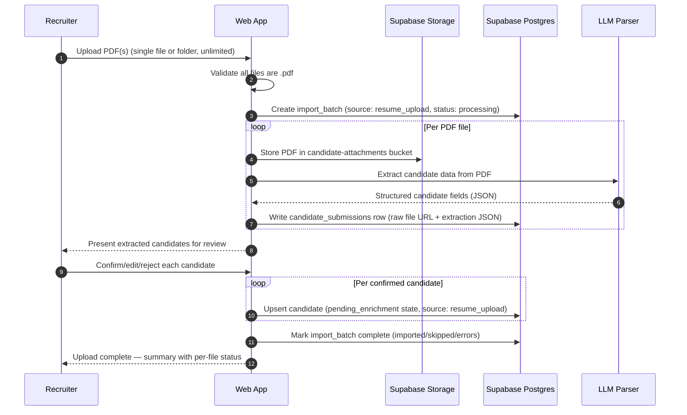

# Sprint Change Proposal — PDF Resume Upload for Recruiters

**Date:** 2026-03-31
**Triggered by:** Story 2.2 scope gap — recruiters need to upload PDF resumes directly, not only structured CSV files
**Change scope classification:** Minor
**Epic affected:** Epic 2 — Candidate Data Ingestion and Profile Lifecycle

---

## Section 1: Issue Summary

Recruiters frequently have candidate information as PDF resumes rather than structured CSV data. The current system (Story 2.2, completed) only accepts CSV uploads, forcing recruiters to manually extract resume content into spreadsheet format before uploading. This defeats the goal of streamlined ingestion.

The system should accept PDF resumes directly — single file or multiple files via folder selection — and use the LLM-powered parser (already built in Story 2.3 for email attachment extraction) to automatically extract candidate data. Only PDF format is accepted; recruiters must convert Word, RTF, or other formats before uploading.

**Evidence supporting this change:**

- Story 2.3 already built `parseCandidateFromEmail()` with LLM extraction and Supabase Storage for attachments (`candidate-attachments` bucket). The extraction pipeline exists but is not wired to a recruiter-facing upload UI.
- The original source PRD mentions "Ingest resumes via email/Textract, CSV uploads" — resume ingestion was always conceptually in scope.
- The `candidate_submissions` table (created in Story 2.3) already supports linking raw file evidence to extracted candidate data.

---

## Section 2: Impact Analysis

### Epic Impact

| Epic | Impact | Details |
|------|--------|---------|
| Epic 2 (Candidate Data Ingestion) | **Additive** | One new story (2.2a) added. No existing stories invalidated or blocked. |
| Story 2.4 (in-progress) | None | Read-only profile/indexing — unaffected by new ingestion path. |
| Story 2.5 (backlog, dedup) | None | PDF-ingested candidates enter `pending_enrichment` state and flow through dedup normally. |
| All other epics | None | No downstream impact. |

### Artifact Conflicts

| Artifact | Status | Details |
|----------|--------|---------|
| PRD | **Update needed** | FR1 only mentions CSV upload. Add FR1b for PDF resume upload. |
| Architecture | **Update needed** | Path 2 is CSV-only. Add Path 2b for PDF resume upload with LLM extraction. Add sequence diagram. |
| UX Design Spec | **Update needed** | Section 7 (Data Import) is CSV-only. Add PDF upload mode selector, review step, and error handling UX. |
| Epics | **Update needed** | Add Story 2.2a, update story size reference, execution package X5, and FR mapping. |
| Sprint Status | **Update needed** | Add story 2.2a entry in backlog. |

### Technical Impact

- **No new infrastructure required.** Reuses existing LLM parser, Supabase Storage bucket (`candidate-attachments`), and `candidate_submissions` table from Story 2.3.
- **No schema changes needed.** The `candidates` table, `import_batch` table, and `candidate_submissions` table already support this flow.
- **Architectural refinement:** Story 2.2a refactors the existing `parseCandidateFromEmail` into a unified `candidate-extraction` service with pluggable content pre-processors. This centralizes the LLM extraction schema and enables future document types without duplicating parsing logic.
- **New code:** Unified extraction service, API route for PDF upload, UI mode selector and review cards on the recruiter upload page.

---

## Section 3: Recommended Approach

**Selected path: Direct Adjustment — add new Story 2.2a within existing Epic 2**

**Rationale:**

- The LLM parser and storage infrastructure from Story 2.3 already exist and are proven (49 real candidates + 51 submissions already ingested from email).
- This is purely additive — no rollback, no scope reduction, no resequencing needed.
- Low risk: the hard part (LLM extraction, storage, candidate persistence) is done. This story is primarily UI + API wiring.
- High value: eliminates the manual resume-to-CSV conversion burden for recruiters.

**Effort estimate:** Medium (3-4 dev days)
**Risk level:** Low
**Timeline impact:** None — slots into backlog after current in-progress work (2.4), before dedup (2.5).

---

## Section 4: Detailed Change Proposals

### 4.1 PRD — Add FR1b

**File:** `docs/planning_artifacts/prd.md` line 756
**Section:** Candidate Management FRs

Insert after FR1:

```
- **FR1b [MVP Tier 1]:** System can ingest candidate records from PDF resume uploads
  (single file or entire folder; PDF format only, no hard cap on file count). The system
  extracts candidate data from each resume via LLM-powered parsing (batched internally),
  presents extracted data for recruiter review before confirmation, and persists validated
  records through the standard ingestion pipeline with `source: resume_upload` attribution.
  Resumes are stored in Supabase Storage (`candidate-attachments` bucket) and linked to the
  candidate record. Non-PDF file types are rejected with a clear message instructing the
  recruiter to convert before uploading. A progress tracker shows per-file extraction status
  for large uploads.
```

---

### 4.2 Architecture — Add Path 2b

**File:** `docs/planning_artifacts/architecture.md` line 138
**Section:** Candidate Data Ingestion Architecture

Rename existing "Path 2" to "Path 2a" and insert after it:

```
**Path 2b — Recruiter PDF resume uploads (on-demand, ongoing):**

- Web UI: recruiter upload page offers a mode selector — CSV or PDF resume. PDF mode
  accepts a single `.pdf` file or multiple `.pdf` files (via multi-file input or folder
  selection). Non-PDF file types are rejected client-side and server-side with a clear
  message.
- Each uploaded PDF is stored in Supabase Storage (`candidate-attachments` bucket) with
  a path of `resume-uploads/{tenant_id}/{batch_id}/{filename}`.
- LLM-powered extraction (reuses the `parseCandidateFromEmail` pipeline from Path 3)
  parses each PDF to extract structured candidate fields (name, email, phone, location,
  skills, certifications, experience).
- Extracted data is presented to the recruiter for review before confirmation — recruiter
  can edit, accept, or reject individual parsed candidates.
- Confirmed records are persisted via the standard ingestion pipeline with
  `source: resume_upload` and `ingestion_state: pending_enrichment`.
- A `candidate_submissions` row is created per PDF linking the raw file URL, extraction
  JSON, and the resulting candidate record.
- Per-file error reporting: PDFs that fail extraction (encrypted, scanned-image-only,
  corrupted) are flagged with clear error messages; the recruiter can retry or skip.
- No hard cap on file count per upload session — recruiters may select an entire folder. The system processes files in internal batches of 50 to bound concurrent LLM extraction cost and memory usage. A progress tracker shows overall and per-file status so the recruiter can monitor large uploads.
```

---

### 4.3 Architecture — Add Sequence Diagram

**File:** `docs/planning_artifacts/architecture.md` line 659
**Section:** After existing CSV import sequence diagram

Insert new sequence diagram:

~~~
### Sequence: PDF Resume Upload (Recruiter)


~~~

---

### 4.4 UX Design Spec — Expand Section 7

**File:** `docs/planning_artifacts/ux-design-specification.md` line 102
**Section:** Design Opportunities §7 — Data Import and Sync Console

Insert after the CSV upload bullet:

```
- **PDF resume upload** (recruiters, on-demand): the recruiter upload page offers a mode
  selector ("Upload CSV" / "Upload Resumes"). Resume mode accepts a single `.pdf` file or
  multiple `.pdf` files via multi-file selector or folder selection. Only PDF format is
  accepted — the UI displays a clear note: "Only PDF files are supported. Please convert
  Word, RTF, or other formats to PDF before uploading." Each uploaded PDF is processed by
  LLM-powered extraction; a review step shows the extracted candidate data per file in an
  editable card layout where the recruiter can accept, edit, or reject each parsed
  candidate before committing. A progress tracker shows per-file extraction status
  (processing/complete/failed). Failed extractions (encrypted PDFs, image-only scans,
  corrupted files) display actionable error messages. No hard cap on file count per session; system batches internally (50 at a time).
```

---

### 4.5 Epics — Add Story 2.2a

**File:** `docs/planning_artifacts/epics.md` line 555
**Section:** After Story 2.2, before Story 2.3

Insert:

```
### Story 2.2a: Implement Recruiter PDF Resume Upload with LLM Extraction

As a recruiter,
I want to upload PDF resumes (single or multiple via folder) and have the system extract
candidate data automatically,
So that I can ingest candidates without manually converting resumes into CSV format.

**Acceptance Criteria:**

**Given** a recruiter uploads one or more PDF files (single file or folder, no hard cap)
**When** the system processes each PDF through LLM-powered extraction (batched internally)
**Then** extracted candidate data is presented for recruiter review before committing
**And** confirmed candidates are persisted with `source: resume_upload` attribution
**And** each PDF is stored in Supabase Storage and linked via `candidate_submissions`
**And** non-PDF files are rejected with a clear message requiring PDF conversion
**And** failed extractions display actionable per-file error messages
**And** a progress tracker shows overall and per-file extraction status for large uploads
```

---

### 4.6 Epics — Update Story Size Reference

**File:** `docs/planning_artifacts/epics.md` line 310-311

Add `- Story 2.2a: M` between Story 2.2 and Story 2.3 entries.

---

### 4.7 Epics — Update Execution Package X5

**File:** `docs/planning_artifacts/epics.md` line 394

Change:

| OLD | `X5 | CSV Ingestion and Indexing | Epic 2 | 2.2, 2.4` |
|-----|-----|
| NEW | `X5 | CSV/Resume Ingestion and Indexing | Epic 2 | 2.2, 2.2a, 2.4` |

---

### 4.8 Epics — Update FR Mapping

**File:** `docs/planning_artifacts/epics.md` line 867

Change:

| OLD | `Candidate Management: FR1, 3, 4, 5, 6, 7` |
|-----|-----|
| NEW | `Candidate Management: FR1, FR1b, 3, 4, 5, 6, 7` |

---

### 4.9 Sprint Status — Add Story 2.2a to Backlog

**File:** `docs/implementation_artifacts/sprint-status.yaml` line 69-70

Insert `2-2a-implement-recruiter-pdf-resume-upload-with-llm-extraction: backlog` between stories 2.3 (done) and 2.4 (in-progress).

---

## Section 5: Implementation Handoff

**Change scope: Minor** — direct implementation by dev team.

**Handoff recipients:**

| Role | Responsibility |
|------|---------------|
| Dev team | Implement Story 2.2a (API route, UI mode selector/review cards, wiring to existing LLM parser) |
| Dev team | Apply all artifact edits listed in Section 4 before story creation |

**Success criteria:**

- Recruiter can upload single PDF or multiple PDFs (via folder) from the upload page
- Only `.pdf` files accepted; other types rejected with clear conversion message
- LLM extraction produces structured candidate data from each PDF
- Recruiter reviews and confirms/edits/rejects each extracted candidate before persistence
- Confirmed candidates appear in the candidates table with `source: resume_upload`
- PDFs are stored in Supabase Storage and linked via `candidate_submissions`
- Failed extractions show actionable per-file error messages
- All artifact updates (PRD, Architecture, UX, Epics, Sprint Status) are committed

**Dependencies:**

- Story 2.3 infrastructure (LLM parser, Supabase Storage bucket, `candidate_submissions` table) — already complete
- Story 2.2 UI (recruiter upload page) — already complete; extended with mode selector
